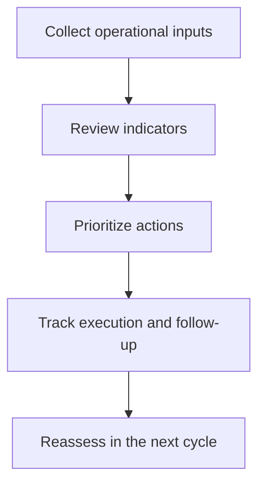

# Workflow

## High-level functional workflow
1. Collect operational inputs
2. Review indicators
3. Prioritize actions
4. Track execution and follow-up
5. Reassess in the next cycle

## Publication boundary
- The workflow is intentionally simplified.
- No internal rules, private thresholds, or sensitive processing detail are described here.
